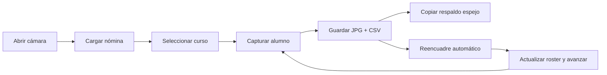
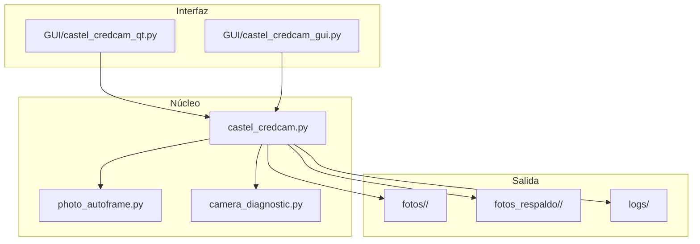
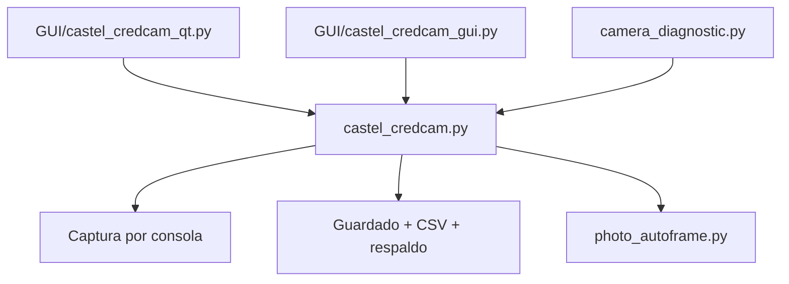

# CastelCredCam

> Captura de fotos tipo credencial por curso, con respaldo espejo, roster, trazabilidad y reencuadre automático postfoto.


CastelCredCam está pensada para jornadas reales de fotografía escolar: abrir cámara, avanzar alumno por alumno, guardar cada toma con nombre claro, mantener una copia espejo y dejar registro en CSV y logs para que la sesión sea recuperable incluso si algo falla a mitad de camino.

## Vista rápida

- Captura local en Windows, sin servicios externos.
- GUI principal en PySide6 para operación real con roster.
- Flujo por consola para pruebas rápidas y diagnóstico.
- Carga de nómina desde Excel o CSV.
- Guardado por curso con `index.csv` y respaldo en `fotos_respaldo/`.
- Reencuadre automático postfoto para centrar mejor la cara.
- Reintento de la última captura con historial.
- Logs técnicos para auditoría y soporte.

## Flujo de trabajo



## Arquitectura



## Qué resuelve

1. Abre una cámara funcional y la negocia con el backend correcto.
2. Trabaja con roster real del curso para avanzar sin perder el orden.
3. Guarda fotos con nombres legibles y RUT cuando está disponible.
4. Mantiene una copia espejo para recuperación rápida.
5. Reencuadra la foto guardada para mejorar la composición final.
6. Deja auditoría en CSV y logs para revisar qué pasó en la sesión.

## Componentes principales

### `castel_credcam.py`

Flujo principal por consola. Sirve para:

- capturas rápidas.
- diagnóstico de cámara.
- sesiones livianas sin interfaz grande.

### `GUI/castel_credcam_qt.py`

GUI principal recomendada para uso diario. Incluye:

- preview en vivo.
- roster por curso.
- avance secuencial de alumnos.
- selección manual de alumno.
- tabla de progreso.
- reintentos.
- respaldo espejo por curso.

### `GUI/castel_credcam_gui.py`

Variante legacy mantenida por compatibilidad interna.

### `photo_autoframe.py`

Postproceso de recorte/reencuadre para centrar mejor el rostro después de guardar.

### `camera_diagnostic.py`

Ayuda a verificar cámaras, índices y backends antes de una jornada.

## Reencuadre automático

La foto no depende solo de cómo se vea el preview. Después de guardar, el sistema vuelve a analizar la imagen y ajusta el encuadre para:

- centrar mejor la cara.
- evitar demasiada pared vacía.
- dejar un margen razonable para hombros y rostro.
- conservar una copia cruda en el respaldo si hace falta revertir.

## Nomenclatura

Cuando hay roster cargado, el archivo se guarda como:

```text
Nombre Alumno-Curso-RUT.jpg
```

Si no hay RUT, la app usa `SIN_RUT`.

Eso permite reconstruir una carpeta aunque el CSV se corrompa o se necesite revisar a mano.

## Estructura de salida

```text
CastelCredCam/
|-- fotos/
|   `-- 7BASICOA/
|       |-- Nombre Alumno-7 BASICO A-12345678.jpg
|       |-- index.csv
|       `-- session_YYYYMMDD_HHMMSS.txt
|-- fotos_respaldo/
|   `-- 7BASICOA/
|       |-- Nombre Alumno-7 BASICO A-12345678.jpg
|       |-- index.csv
|       `-- retakes.csv
`-- logs/
    |-- gui_qt_YYYYMMDD_HHMMSS_PID.log
    `-- cli_YYYYMMDD_HHMMSS_PID.log
```

## Instalación

```powershell
cd C:\Users\Jack\Documents\GitHub\Experimentos\Castel\CastelCredCam
py -m pip install -r requirements.txt
```

Si tu entorno no usa `py`:

```powershell
python -m pip install -r requirements.txt
```

## Ejecución

### GUI principal

```powershell
cd C:\Users\Jack\Documents\GitHub\Experimentos\Castel\CastelCredCam\GUI
py .\castel_credcam_qt.py
```

O con:

```text
GUI\run_castel_credcam_gui.bat
```

### Consola

```powershell
cd C:\Users\Jack\Documents\GitHub\Experimentos\Castel\CastelCredCam
py .\castel_credcam.py
```

O con:

```text
run_castel_credcam.bat
```

### Cámara preseleccionada

```powershell
py .\castel_credcam.py --camera-index 3 --backend dshow
```

### Diagnóstico de cámara

```powershell
py .\camera_diagnostic.py
```

## Reintentos y respaldo

Cuando una foto se rehace:

- la última captura puede eliminarse desde la GUI.
- la copia anterior se conserva en el respaldo.
- si ya existía el archivo, se guarda una variante con sufijo `__reintento_YYYYMMDD_HHMMSS`.
- el respaldo escribe una entrada en `retakes.csv` con nota `reintento`.

## Mapa de módulos



## Compatibilidad de cámara

Tipos de cámara que suelen funcionar:

- webcam integrada.
- webcam USB.
- cámara virtual desde celular con apps como Iriun, DroidCam, iVCam o Camo.

## Requisitos

- Windows 10 u 11.
- Python 3.10 o superior recomendado.
- una cámara funcional en Windows.

## Seguridad y privacidad

El repositorio está pensado para trabajar con datos locales y no publicar material sensible por accidente.

Se ignoran normalmente:

- `fotos/`
- `fotos_respaldo/`
- `logs/`
- caches de Python
- entornos virtuales
- archivos locales de editor y sistema

## Si quieres ir más lejos

Puedo dejar este README todavía más visual con:

- una captura real de la GUI.
- un GIF corto del flujo de captura.
- una tabla de cursos y salidas.
- un diagrama más detallado de la ruta de datos.
