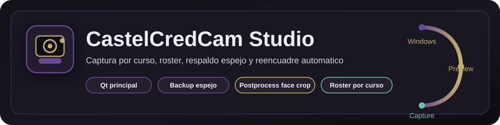
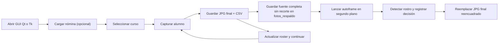
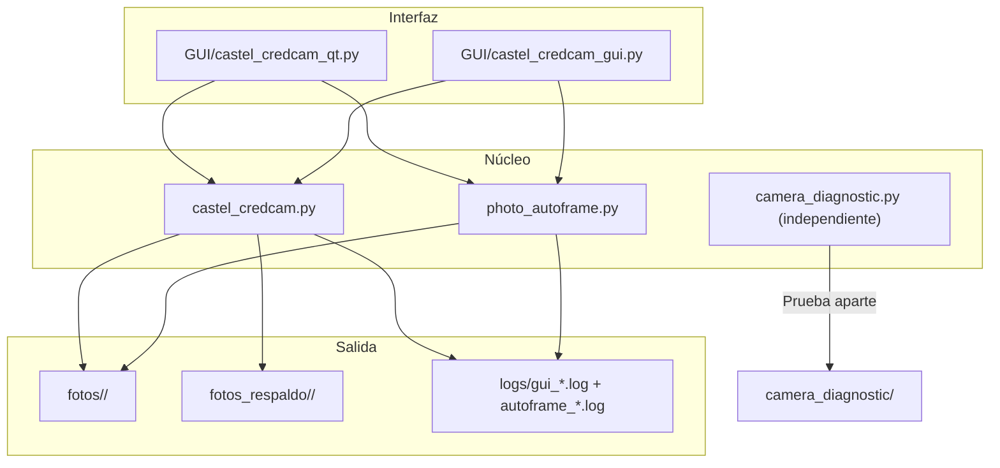
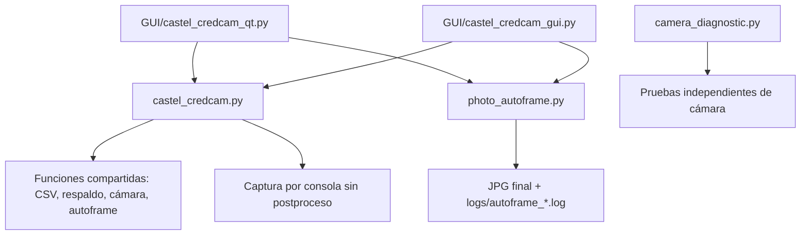

# CastelCredCam

> Captura de fotos tipo credencial por curso, con respaldo espejo, roster, trazabilidad y reencuadre automático diagnosticable en las interfaces gráficas.



CastelCredCam está pensada para jornadas reales de fotografía escolar: abrir cámara, avanzar alumno por alumno, guardar cada toma con nombre claro, mantener una copia espejo y dejar registro en CSV y logs para que la sesión sea recuperable incluso si algo falla a mitad de camino.

## Vista rápida

- Captura local en Windows, sin servicios externos.
- GUI principal en PySide6 para operación real con roster.
- Flujo por consola para capturas rápidas sin roster ni autoframe postfoto.
- Carga de nómina desde Excel o CSV.
- Guardado por curso con `index.csv` y respaldo en `fotos_respaldo/`.
- Configuración local opcional para usar fotos y nóminas fuera del repositorio.
- Reencuadre automático postfoto en las GUIs, con descarte de falsos rostros y margen para la cabeza.
- Reintento de la última captura; auditoría persistente en Tk legacy y consola.
- Logs técnicos de sesión y de decisión del autoframe para auditoría y soporte.

## Flujo de trabajo



## Arquitectura



## Qué resuelve

1. Abre una cámara funcional y la negocia con el backend correcto.
2. Trabaja con roster real del curso para avanzar sin perder el orden.
3. Guarda fotos con nombres legibles y RUT cuando está disponible.
4. En las GUIs mantiene una copia previa al postproceso para recuperación rápida.
5. En las GUIs reencuadra la foto guardada, priorizando rostros confirmados por ojos y evitando acercamientos a falsos positivos.
6. Deja auditoría en CSV y logs, incluido el motivo técnico de cada autoframe.

## Componentes principales

### `castel_credcam.py`

Flujo de captura por consola. Sirve para:

- capturas rápidas.
- selección de cámara/backend y sesiones livianas sin interfaz grande.
- generar `session_*.txt` al cerrar una sesión.

No importa nóminas ni lanza `photo_autoframe.py`; guarda el frame capturado y su respaldo directamente.

### `GUI/castel_credcam_qt.py`

GUI principal recomendada para uso diario. Incluye:

- preview en vivo.
- roster por curso.
- avance secuencial de alumnos.
- selección manual de alumno.
- tabla de progreso.
- reintentos.
- respaldo espejo por curso.
- reencuadre postfoto asincrónico con log de diagnóstico.

### `GUI/castel_credcam_gui.py`

Variante legacy mantenida por compatibilidad interna. También ejecuta el reencuadre postfoto y conserva auditoría de reintentos en `retakes.csv`.

### `photo_autoframe.py`

Postproceso invocado por las GUIs después de guardar y respaldar la toma. Genera un log `autoframe_*.log` por ejecución.

### `camera_diagnostic.py`

Utilidad independiente que captura imágenes de diagnóstico para verificar cámaras, índices y backends antes de una jornada.

## Reencuadre automático

En las interfaces Qt y Tk, la foto no depende solo de cómo se vea el preview. La GUI guarda el JPG principal con los ajustes activos, crea un respaldo de la fuente completa sin recorte de credencial y ejecuta `photo_autoframe.py` en segundo plano sobre el JPG principal. El postproceso:

- busca candidatos de rostro y solo reemplaza la foto si confirma un par de ojos con separación y altura plausibles.
- descarta candidatos bajos sin confirmación que suelen ser ropa o mobiliario.
- reserva margen sobre la cara para no cortar cabello o cabeza.
- conserva la imagen guardada sin aplicar un segundo recorte si no encuentra un rostro confiable.
- escribe en `logs/autoframe_*.log` qué candidato eligió o descartó y qué caja final aplicó.

El respaldo de `fotos_respaldo/<curso>/` conserva el frame fuente con espejo/rotación aplicados, pero sin el recorte tipo credencial ni el segundo recorte de `photo_autoframe.py`. Eso permite recuperar material real cuando el encuadre automático corta una cara o se va al fondo.

## Nomenclatura

Cuando hay roster cargado, el archivo se guarda como:

```text
Nombre Alumno-Curso-RUT.jpg
```

Si no hay RUT, la app usa `SIN_RUT`.

Eso permite reconstruir una carpeta aunque el CSV se corrompa o se necesite revisar a mano.

## Estructura de salida

```text
CastelCredCam/
|-- fotos/
|   `-- 7BASICOA/
|       |-- Nombre Alumno-7 BASICO A-12345678.jpg
|       |-- index.csv
|       `-- session_YYYYMMDD_HHMMSS.txt
|-- fotos_respaldo/
|   `-- 7BASICOA/
|       |-- Nombre Alumno-7 BASICO A-12345678.jpg
|       |-- index.csv
|       `-- retakes.csv
`-- logs/
    |-- gui_qt_YYYYMMDD_HHMMSS_PID.log
    |-- gui_YYYYMMDD_HHMMSS_PID.log
    |-- cli_YYYYMMDD_HHMMSS_PID.log
    `-- autoframe_YYYYMMDD_HHMMSS_PID.log
```

En equipos de operación real, la GUI puede leer `local_config.json` para guardar las fotos fuera del repositorio, por ejemplo en `D:\Colegio\Fotos_Perfil_Estudiantes_Castel`, y cargar una nómina predeterminada al abrir. Ese archivo está ignorado por Git junto con `fotos/`, `fotos_respaldo/` y `auditoria_fotos/`, porque las fotos y datos de estudiantes no deben versionarse.

## Installation

```powershell
cd C:\Users\Jack\Documents\GitHub\Experimentos\Castel\CastelCredCam
py -m pip install -r requirements.txt
```

Si tu entorno no usa `py`:

```powershell
python -m pip install -r requirements.txt
```

## Ejecución

### GUI principal

```powershell
cd C:\Users\Jack\Documents\GitHub\Experimentos\Castel\CastelCredCam\GUI
py .\castel_credcam_qt.py
```

O con:

```text
GUI\run_castel_credcam_gui.bat
```

### Consola

```powershell
cd C:\Users\Jack\Documents\GitHub\Experimentos\Castel\CastelCredCam
py .\castel_credcam.py
```

O con:

```text
run_castel_credcam.bat
```

### Cámara preseleccionada

```powershell
py .\castel_credcam.py --camera-index 3 --backend dshow
```

### Diagnóstico de cámara

```powershell
py .\camera_diagnostic.py
```

## Reintentos y respaldo

El flujo de respaldo de las GUIs ocurre antes de ejecutar el postproceso y guarda la fuente completa sin recorte de credencial. Si al guardar ya existe un respaldo con el mismo nombre, la nueva copia usa el sufijo `__reintento_YYYYMMDD_HHMMSS`; en Qt, el botón de rehacer elimina primero el respaldo base.

Al pulsar rehacer, la implementación actual difiere por interfaz:

| Interfaz | Comportamiento actual de `Rehacer última` |
| --- | --- |
| Qt principal | elimina la foto vigente y su archivo de respaldo con el mismo nombre; actualiza el CSV. |
| Tk legacy | elimina la foto vigente, mantiene los respaldos existentes y registra la acción en `retakes.csv`. |
| Consola | al rehacer elimina el JPG vigente y registra `retakes.csv`; si luego se captura de nuevo el mismo nombre, su respaldo se reemplaza. |

## Mapa de módulos



## Compatibilidad de cámara

Tipos de cámara que suelen funcionar:

- webcam integrada.
- webcam USB.
- cámara virtual desde celular con apps como Iriun, DroidCam, iVCam o Camo.

## Prerequisites

- Windows 10 u 11.
- Python 3.10 o superior recomendado.
- una cámara funcional en Windows.

## Seguridad y privacidad

El repositorio está pensado para trabajar con datos locales y no publicar material sensible por accidente.

Se ignoran normalmente:

- `fotos/`
- `fotos_respaldo/`
- `logs/`
- caches de Python
- entornos virtuales
- archivos locales de editor y sistema

## Notas de mejora

Más adelante se le puede sumar:

- una captura real de la GUI principal.
- un GIF corto del flujo de captura.
- una tabla simple con cursos y salidas.
- un diagrama más fino de la ruta de datos.

<!-- Updated for 2026 active baseline maintenance -->
